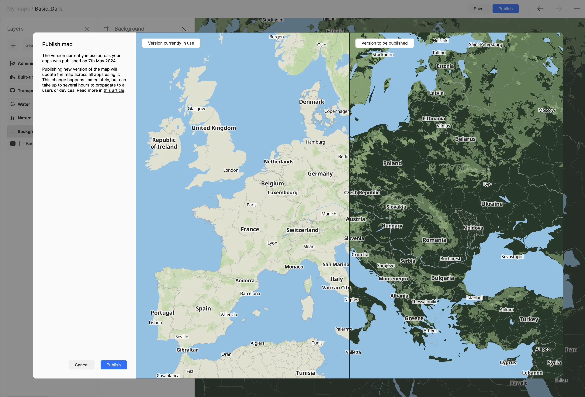

# Custom Map Styles

You may decide that you'd like to modify the style document which is used to
draw the maps in Wizarr. In addition to visual customization, this also allows
you to pick your own map tile provider instead of the default one. The default
`style.json` for [light theme](https://github.com/wizarrrrr/wizarr/tree/main/server/resources/style-light.json)
and [dark theme](https://github.com/wizarrrrr/wizarr/blob/main/server/resources/style-dark.json)
can be used as a basis for creating your own style.

There are several sources for already-made `style.json` map themes, as well as
online generators you can use.

1. In **Wizarr**, navigate to **Administration --> Settings --> Map & GPS Settings** and expand the **Map Settings** subsection.
2. Paste the link to your JSON style in either the **Light Style** or **Dark Style**. (You can add different styles which will help make the map style more appropriate depending on whether you set **Wizarr** to Light or Dark mode.)
3. Save your selections. Reload the map, and enjoy your custom map style!

## Use Maptiler to build a custom style

Customizing the map style can be done easily using Maptiler, if you do not want to write an entire JSON document by hand.

1. Create a free account at https://cloud.maptiler.com
2. Once logged in, you can either create a brand new map by clicking on **New Map**, selecting a starter map, and then clicking **Customize**, OR by selecting a **Standard Map** and customizing it from there.
3. The **editor** interface is self-explanatory. You can change colors, remove visible layers, or add optional layers (e.g., administrative, topo, hydro, etc.) in the composer.
4. Once you have your map composed, click on **Save** at the top right. Give it a unique name to save it to your account.
5. Next, **Publish** your style using the **Publish** button at the top right. This will deploy it to production, which means it is able to be exposed over the Internet. Maptiler will present an interactive side-by-side map with the original and your changes prior to publication. 
6. Maptiler will warn you that changing the map will change it across all apps using the map. Since no apps are using the map yet, this is okay.
7. Clicking on the name of your new map at the top left will bring you to the item's **details** page. From here, copy the link to the JSON style under **Use vector style**. This link will automatically contain your personal API key to Maptiler.
